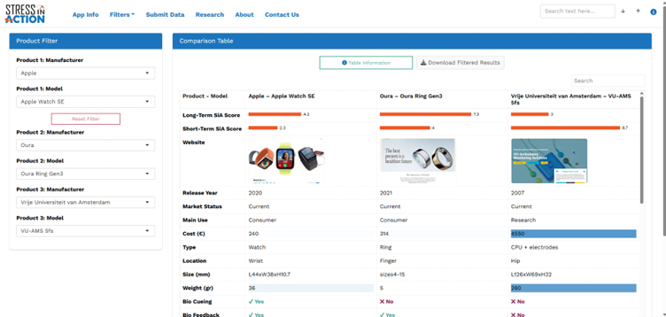
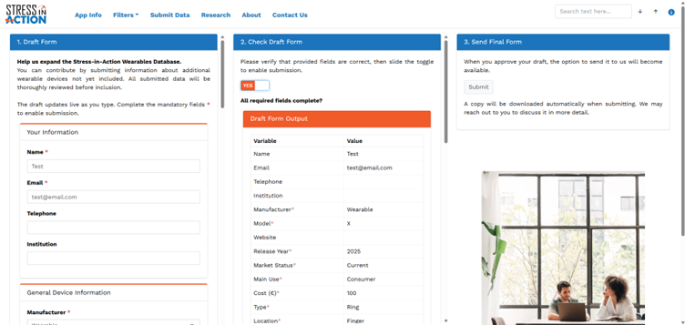
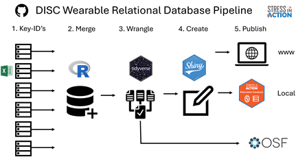

# Summary

SiA-WD is an open-source R Shiny application for selecting physiological wearables from the Stress in Action Wearables Database (SiA-WD). Based on peer-reviewed research by Schoenmakers et al. [@schoenmakers2025siawd], the application enables users to explore and compare an extensive range of devices using two modules: a Product Filter for side-by-side comparisons and a Feature Filter including 43 filter options across six categories: SiA Expert Scores, General Device Information, Technical Specifications, Signals Measured, Data Access and Validation, and Reliability & Usability. Maintained by the Stress in Action consortium and supported by community contributions, the database will be continuously updated throughout the next decade. SiA-WD improves transparency, reproducibility, and efficiency in device selection and is freely accessible at https://wearables.stress-in-action.nl or can be run locally as a golem-based Shiny application.

# Statement of Need

Ambulatory wearable devices are widely used across psychology, medicine, and behavioural science to monitor physiological signals in daily life [@patel2012rehabilitation; @pevnicks2018update; @patel2021hospital]. These devices allow continuous measurement of activity, heart rate, skin conductance, and related physiological processes [@majumder2017wearable; @peake2018critical]. While wearable technology has advanced rapidly, researchers face growing challenges in selecting appropriate devices for stress research.

Device selection often involves manually comparing technical specifications, recorded signals, and the scientific literature on validity, reliability, and usability—an effort-intensive and error-prone process [@giurgiu2022quality; @haddad2020ecological]. Existing reviews and online listings are typically static, incomplete, outdated, or focused on consumer rather than scientific use cases [@iqbal2016review; @paredes2022chimera; @vijayan2021review; @lu2023remote].

To address these limitations, Schoenmakers et al. developed the Stress in Action Wearables Database (SiA-WD) [@schoenmakers2025siawd], a curated, open-access resource designed to support evidence-based selection of physiological wearables in behavioural and stress research. The database is described in a peer-reviewed publication in *Behavior Research Methods* and is openly available via the Open Science Framework (https://osf.io/umgvp/). It includes detailed device metadata, systematic literature reviews, and expert scores covering more than 100 devices relevant to stress-related physiology. The database will be updated for at least a decade (2023–2033).

Delivered through an interactive R Shiny application, the tool allows users to explore, filter, and compare devices dynamically. Unlike static summaries, this interface supports flexible and reproducible workflows for study planning, cohort selection, and grant preparation. By reducing the effort required to make informed device choices, SiA-WD supports methodological rigor and transparency in stress-related physiological research.

# Overview

The Shiny application provides two complementary modes of exploration: Product Comparison and Feature-Based Filtering, plus a Submit section where users can suggest new wearables to be added or existing data to be updated.

## Product Filter

The Product Filter module allows users to compare up to three wearable devices side by side. Each product is selected in two steps: choosing a manufacturer, followed by selecting a model associated with that manufacturer. Once one or more products are selected, the app generates a transposed comparison table in which rows display device features and columns correspond to the selected devices. This layout enables direct, feature-by-feature comparison of general specifications, recorded signals, usability ratings, and validation data.

Users may optionally clear a selected device using the Reset Filter button or export the current comparison table using the Download Filtered Products button.

Figure 1 – Overview of the Product Filter with output based on three selected manufacturers and models.

## Feature Filter

The Feature Filter provides a more exploratory approach. Researchers can filter the database using up to 41 variables, grouped into six thematic categories. The filters are modular and interactively update to ensure only valid combinations are selectable.

**SiA Expert Score** 
- Long-term score  
- Short-term score  
- Exclusion of devices with missing scores  

**General Device Information** 
- Manufacturer  
- Model  
- Release year  
- Market status  
- Intended use  
- Cost  
- Device type  
- Wear location  

**Technical Specifications** 
- Water resistance  
- Battery life  
- Charging duration  
- Bio-cueing support  
- Biofeedback support  

**Signals Measured** 
- Accelerometer  
- Blood pressure  
- Electrocardiography (ECG)  
- Electrodermal activity (EDA)  
- Electroencephalography (EEG)  
- Electromyography (EMG)  
- Global positioning system (GPS)  
- Gyroscope  
- Impedance cardiography (ICG)  
- Photoplethysmography (PPG)  
- Respiration  
- Skin temperature  
- Other measured signals  

**Data Access** 
- Raw data availability  
- Internal storage  
- Server-based storage  
- Storage capacity (MB)  
- Storage duration (hours)  
- General Data Protection Regulation (GDPR) compliance  
- Conformité Européenne (CE) marking  
- Food and Drug Administration (FDA) clearance  

**Reliability, Validation & Usability** 
- Number of studies  
- Validation levels  
- Usability ratings  

Figure 2 – Results of the Feature Filter with a Long-Term SiA score ≥ 7, excluding devices with missing Long- and Short-Term SiA scores.

The app’s backend logic dynamically filters and updates all input fields so that the current selection state is always coherent with the dataset. This prevents incompatible or missing-value combinations and guarantees a smooth, data-consistent filtering experience. For each device, more granular information from the full SiA-WD database can be accessed by clicking the “More Details” button in the Details column.

At any point, users can download the filtered result table for reporting or documentation and export the current filter settings for reproducibility.

## Submit

Community contributions are encouraged through a Submit section that enables users to add new wearable devices or suggest updates to existing entries. The submission interface mirrors the structure of the Feature Filter and guides contributors through a structured form organized into the same six categories. Submitted entries are reviewed by the SiA-WD team prior to publication.

Figure 3 – Submission form showing all mandatory fields completed, enabling submission.

# Deployment

The SiA-WD Shiny application is deployed as a publicly accessible web-based tool at https://wearables.stress-in-action.nl. The application is hosted on a dedicated virtual machine maintained by Vrije Universiteit Amsterdam, running Linux Ubuntu 24.04 LTS with Shiny Server and Nginx.

Users who wish to run the application locally can do so using the golem-based framework on which the app is built.

install.packages("remotes")
remotes::install_github("HugoGit39/siawd")

After installation, the application can be started with:

siawd::run_app()
Periodic updates are required to ensure access to the most recent database and application functionality.

# Data Sources and Dependencies

The SiA-WD database is generated through a reproducible relational data pipeline implemented in a public GitHub repository (https://github.com/HugoGit39/sia.project.1.wd.data). The pipeline follows the methodological framework described by Schoenmakers et al. [@schoenmakers2025siawd] and applies reproducible research principles for relational database construction [@picardi2024reproducible].

Figure 4 – Overview of the SiA-WD relational data pipeline: (1) source data frames linked by device key identifiers; (2) relational merging of source tables; (3) generation of Shiny-ready data frames (RDS) and OSF-compatible data frames (Excel); (4) construction of the SiA-WD Shiny applications (live and local golem-based versions); and (5) public publication.

In line with open science principles, curated exports of the SiA-WD database are publicly disseminated via the Open Science Framework and are available at https://osf.io/umgvp/.

The accompanying Shiny application was built under R version 4.4.1 and relies on open-source R packages available via CRAN or GitHub, including shiny [@rstudio2012shiny], bs4Dash [@rinterface2018bs4dash], fresh [@dreamrs2019fresh], shinyWidgets [@dreamrs2017shinywidgets], shinycssloaders [@attali2017shinycssloaders], shinyjs [@attali2015shinyjs], sever [@coene2020sever], shinySearchbar [@norris2020shinysearchbar], dplyr [@tidyverse2012dplyr], lubridate [@tidyverse2009lubridate], rlang [@rlib2016rlang], scales [@rlib2010scales], reactable [@lin2019reactable], reactablefmtr [@cuilla2021reactablefmtr], htmltools [@rstudio2014htmltools], htmlwidgets [@vaidyanathan2014htmlwidgets], and writexl [@ooms2017writexl].

# Acknowledgements

We thank Myrte Schoenmakers, Melissa Saygin, and Artemis Stefani (Vrije Universiteit Amsterdam), and Magdalena Sikora and Matthijs Noordzij (University of Twente) for user experience input and testing of SiA-WD.

# Funding

This work is supported by the Stress in Action project (www.stress-in-action.nl), funded by the Dutch Research Council and the Ministry of Education, Culture and Science through the NWO Gravitation programme (grant number 024.005.010).

# References
